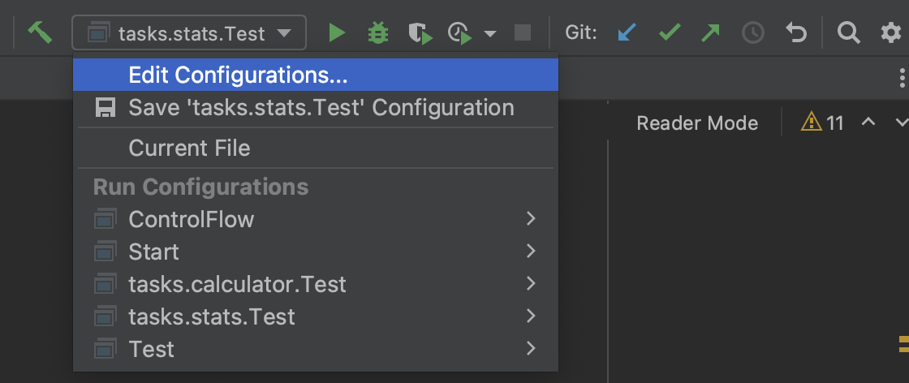
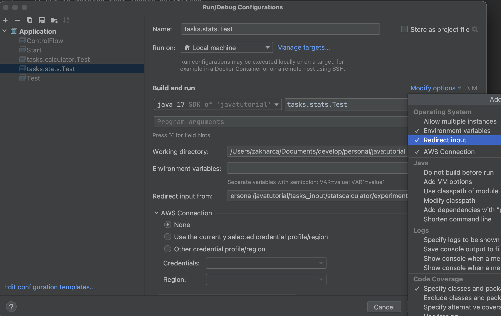
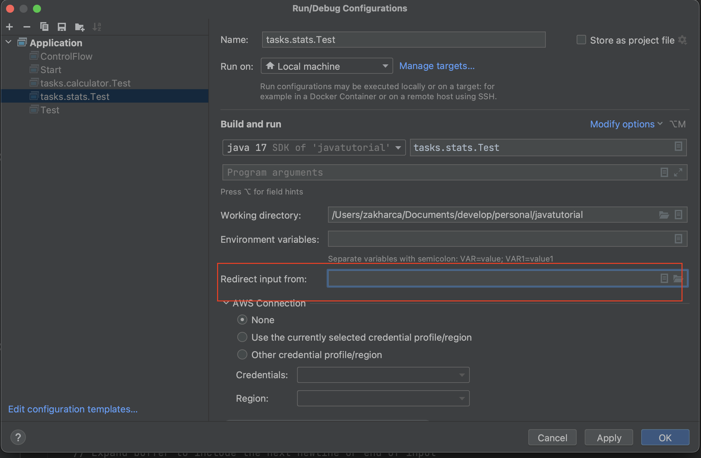

# Statistics calculator

The goal of this task is to process records of numeric experiments, compute basics statistics from the experiments
and to output the statistics in a nice human-readable table.

# Input format

* First line consist of 4 integers separated by space. This corresponds to width of columns in a final table.
    * First number: width of index column
    * Second number: width of mean column
    * Third number: width of SD column
    * Fourth number: width of Median column

* All next rows contain sequences of real numbers separated by space. The lengths of rows is not known in advance and it
  can vary from row to row.
    * Number of rows with sequences is not know in advance
    * Input always contains at least one sequence row (you don't need to check for this)

## Input example:

```
3 3 1 3
94.6286 61.5523 20.3520 18.3625 50.0766
41.5148 39.9174 14.0425 12.7796 90.3956 31.6283 67.8751 83.7008
94.8473 85.3099 34.5753 23.6202 89.8463 28.8784
18.5474 89.6531 19.6723 46.7522 78.3156
```

# Output format

* First row of table contains the table name: `'|-----Statistics of input-----|'` number of `-` characters should
  be determined dynamically based on table width
* Second row of table is *separator line* `+-----+-------+-------+-------+`. The separator line has `+` sign in the
  beginning and in the end and also for each column in the table.
* Third row of table is header: `'| index | mean | SD | medians |'` number of spaces should be determined dynamically
  and words should be centered. The width of each of this column is determined from first row of user input. Each
  column should have the following minimal width
    * index column - 5 spaces
    * mean column - 5 spaces
    * SD - 5 spaces
    * median - 7 spaces
* Fourth row is separator line.
* Next rows are rows with statistics for each line of input (except first row).
    * index - corresponds to the sequence number in the input (start with 1). This number should
      be left aligned in the output table
    * mean - mean of a sequence. The number should be right aligned and rounded to two decimal places
    * SD - standard deviation of a sequence. The number should be right aligned and rounded to two decimal places
    * medians - median of the sequence. The number should be right aligned and rounded to two decimal places
    * each column should be separated by `|` character
    * each statistics row should be separated by separator line
* The table should end with separator line

## Output example:

given first line was '5 7 7 7'

```
|-----Statistics of Input-----| 
+-----+-------+-------+-------+
|Index|  Mean |   SD  | Median|
+-----+-------+-------+-------+
|1    |  23.23|   0.35|     21|
+-----+-------+-------+-------+
```

# Notes

## How to compute median

Given a vector `V` of length `N`, the median of `V` is the middle value of a sorted copy of `V`, `V_sorted`. That means
when `N` is odd the median is `V_sorted[(N-1)/2]`. And when `N` is even median equals to average of the
two middle values of `V_sorted`.

### Example:

```
V = [1,2,3] // N is odd
median = 2

V = [1,2,3,4] // N is even
median = (2+3)/2 = 2.5
```

## How to compute standard deviation

Given a vector `V` of length `N`. The standard deviation is the square root of the average of the squared
deviations from the mean, i.e.

```latex
\sigma = \sqrt{\sum_i^N{(x_i - \mu)^2}}
```

where `x_i` is i-th elemt of `V` and `\mu` is mean of `V`.

## How to compute mean

```latex
\mu = \sum_i^N{x_i}/N
```

## Be careful with user input

Remember that you should validate user input. Print an error to standard error when input format is invalid.

## How to run the tests

For this task you have input files prepared for you under `tasks_input/statscalculator/experiments` folder. Also you
have a solution for each experiment under `tasks_input/statscalculator/results`.

You have two options on how to run each experiment. First one is using Redirect input feature of IntelliJ.
For this you can edit Run\Debug Configuration of the Test class.

### Running tests with IntelliJ redirect input

1. In the upper right corner press Edit configuration:
   
2. Make sure that you have Redirect Input From field available if not press more options and check this field
   
3. Choose a file from which to redirect the input
   

### Running tests from console

Alternatively, you can copy the contents of experiment file. Start the application and paste the content to console.
After you paste the console press CMD+D to indicate that you finished entering the input. 